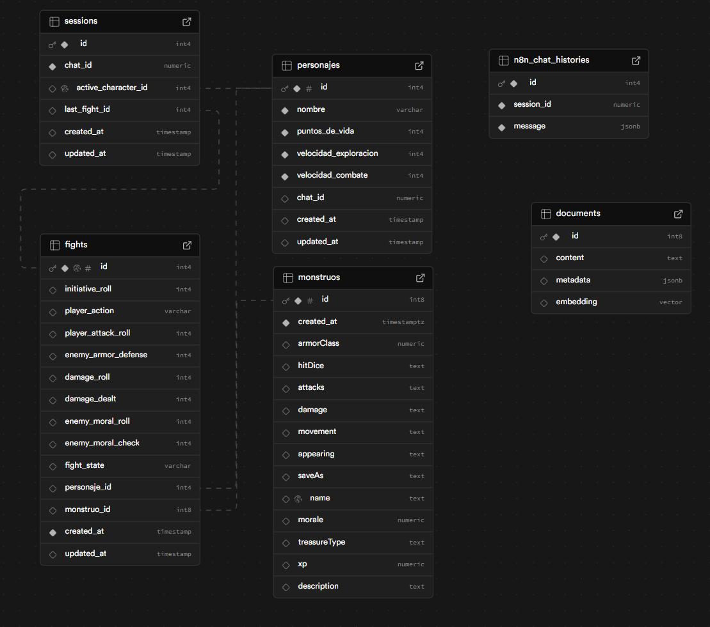

# Arquitectura

## Componentes Principales

### Base de Datos (Supabase)
- **Tablas Relevantes**:
Entendido. A continuación, se proporciona una descripción breve y directa de cada tabla relevante en la base de datos:

---

### **Tablas Relevantes**

#### **1. `sessions`**
- **Descripción**: Gestiona sesiones de usuarios.
- **Tipo**: Tabla para rastrear información sobre sesiones activas o históricas.

#### **2. `personajes`**
- **Descripción**: Almacena información de personajes.
- **Tipo**: Tabla que contiene detalles específicos de los personajes del juego.

#### **3. `fights`**
- **Descripción**: Registra detalles de peleas.
- **Tipo**: Tabla para almacenar información relacionada con combates entre personajes y monstruos.

#### **4. `monstruos`**
- **Descripción**: Contiene información de monstruos.
- **Tipo**: Tabla que describe atributos y características de los monstruos.

#### **5. `documents`**
- **Descripción**: Almacena embeddings vectoriales.
- **Tipo**: Tabla para gestionar datos vectoriales usados en búsquedas semánticas o procesamiento de lenguaje natural. 

#### **6. `n8n_chat_histories`**
- **Descripción**: Registra historial de mensajes de chat.
- **Tipo**: Tabla para almacenar conversaciones o interacciones de texto.

---

Esto resume las tablas sin incluir suposiciones adicionales.

### Flujo de Trabajo (n8n)
- **Telegram Trigger**: Inicia el flujo.
- **AI Agent**: Interpreta el contexto del mensaje.
- **Text Classifier**: Clasifica el texto del usuario (para asegurar que el agente utilizado es el correcto)
- **Agentes Especializados**: Usados para crear personajes, listar personajes, crear partidas... (CRUD sobre personajes y partidas)
- **Agente Final**: Encargado de embellecer el texto para el usuario final, y dar posibles acciones en cada caso.

### Modelos de Lenguaje (LLM)
- Modelos como OpenAI Chat Model (4o-mini y text-embeddings-ada-002) y Google Gemini Chat Model (Gemini 2.0 Flash). He usado estos modelos ya que son eficientes para las tareas que he necesitado realizar, además de ser más eficientes en términos de costos.

### Persistencia de Datos
- Sesiones gestionadas mediante timestamps (`updated_at`).
- Partidas persistentes en la tabla `fights`.

## Diagrama de Flujos
- **Flujo Principal**:
  1. Telegram Trigger → AI Agent → Text Classifier → Agentes Especializados → Agente Final.

---
  Además, en telegram aparecerá un menú con operaciones que el usuario puede realizar en todo momento.